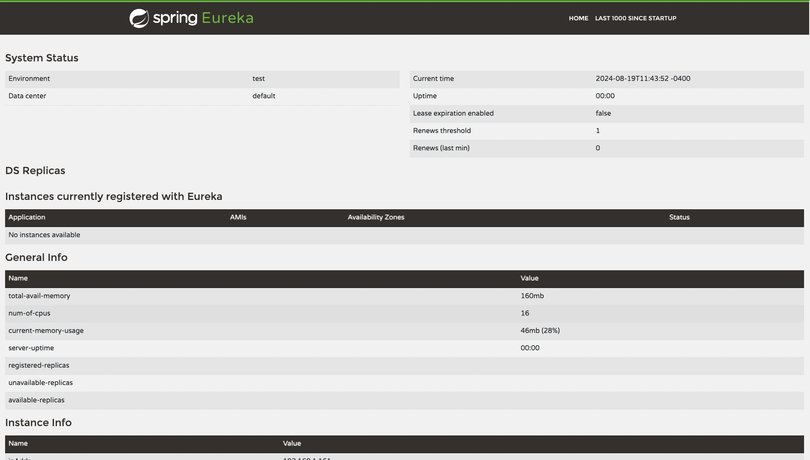
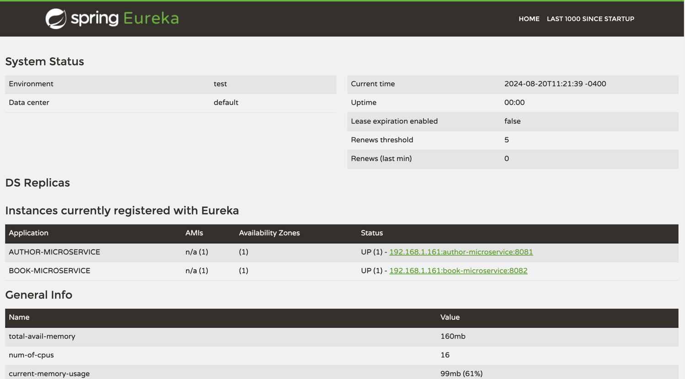

#  Microservices Service Discovery

| Title                           | Type   | Duration | Author               |
|---------------------------------|--------|----------|----------------------|
| Microservices Service Discovery | Lesson | 5:00     | Suresh Melvin Sigera |

## Lesson Objectives

- Creating Discovery Server for Microservices
- Creating Config Server for Microservices
- Setting up API Gateway for Microservices

## Introduction

In this lesson, we delve into the setup of a Spring Cloud Discovery Server using Eureka, a service discovery tool
developed by Netflix. Eureka plays a crucial role in managing and locating microservices within distributed systems,
facilitating dynamic service registration and discovery.

### Understanding Discovery Servers in Depth (10 minutes)

- **Service Registration and Discovery:** Microservices such as order processing, inventory management, and user
  authentication register with Eureka. When a service needs to communicate with another, it queries Eureka for the
  target service's location.
- **Load Balancing:** During high-traffic periods, multiple instances of critical services can be run. Eureka enables
  client-side load balancing, distributing requests across these instances to prevent overload.
- **Fault Tolerance:** If a service instance fails, Eureka detects this and stops routing requests to it, ensuring that
  other healthy instances continue to serve requests.
- **Dynamic Configuration:** New services can be added without reconfiguring the entire system, allowing for independent
  updates and scaling.
- **Centralized Management:** Eureka provides a dashboard for monitoring and troubleshooting, offering a centralized
  view of all registered services.
- **Scalability:** As the system grows, services can be scaled by adding new instances, which automatically register
  with Eureka.

### Example: E-commerce Order Processing Flow

Consider how Eureka facilitates an order flow in an e-commerce system:

1. A customer places an order through the web interface.
2. The web service queries Eureka for the order processing service's location.
3. Eureka returns the addresses of available service instances.
4. The web service sends the order to one of these instances.
5. The order processing service checks inventory by querying Eureka for the inventory management service.
6. This process continues for services like payment processing and shipping.

Throughout this flow, Eureka ensures that requests are routed to healthy instances, maintaining system reliability.

### Setting Up Eureka Server (15 minutes)

To set up a Discovery Server using Spring Boot, you need to include the `org.springframework.cloud` dependency for
the `discovery` module.

1. Modify the `pom.xml`and add the Eureka Server dependency.
   ```xml
    <dependency>
      <groupId>org.springframework.cloud</groupId>
      <artifactId>spring-cloud-starter-netflix-eureka-server</artifactId>
    </dependency>
   ```
2. Update the Main Application Class: Annotate with `@EnableEurekaServer`.
   ```java
    package org.example.discovery;

    import org.springframework.boot.SpringApplication;
    import org.springframework.boot.autoconfigure.SpringBootApplication;
    import org.springframework.cloud.netflix.eureka.server.EnableEurekaServer;
    
    @SpringBootApplication
    @EnableEurekaServer
    public class DiscoveryApplication {
    
        public static void main(String[] args) {
            SpringApplication.run(DiscoveryApplication.class, args);
        }
    }
   ```

### Spring Cloud Discovery Server Configuration (15 minutes)

Configure the Discovery Server in `application.properties`:

```properties
spring.application.name=discovery
eureka.instance.hostname=localhost
eureka.client.register-with-eureka=false
eureka.client.fetch-registry=false
eureka.client.service-url.defaultZone=http://${eureka.instance.hostname}:${server.port}/eureka/
server.port=8761
spring.config.import=optional:configserver:http://localhost:8888
```

### Configuration Breakdown

- `spring.application.name=discovery:` Sets the name of your application, which will be used to identify this service.
- `eureka.instance.hostname=localhost:` Specifies the hostname on which Eureka will run. Here, it's set to localhost for
  local development.
- `eureka.client.register-with-eureka=false:` Tells the Eureka server not to register itself as a client since this is
  the server.
- `eureka.client.fetch-registry=false:` Prevents the server from fetching registry information from other Eureka
  servers, as this is a standalone server.
- `eureka.client.service-url.defaultZone=http://${eureka.instance.hostname}:${server.port}/eureka/:` Defines the URL
  where Eureka clients can register themselves and fetch the registry.
- `server.port=8761:` Sets the port on which the Eureka server will run. `8761` is the default port for Eureka servers.
- `spring.config.import=optional:configserver:http://localhost:8888:` Related to Spring Cloud Config, it tells the
  application to optionally import configurations from a Config Server running on `localhost:8888`.

This configuration sets up a standalone Eureka server that doesn't register with itself or fetch registries from
elsewhere. It's ready to accept registrations from other services and provide service discovery functionality. The last
line also shows integration with a Config Server, which is often used alongside Eureka in Spring Cloud applications for
centralized configuration management.

Great! Now that you have set up your Discovery Server, let's run the application and verify that it's working correctly.

Once your Discovery Server is up and running, open your browser and navigate to http://localhost:8761 to access the
Eureka dashboard.



Here, you will see a message indicating that no instances are currently available. This dashboard provides a visual
representation of the services registered with the Discovery Server, enabling you to effectively monitor and manage your
microservices.

## Setting up the Config Server (50 minutes)

In microservices architectures, managing configuration across multiple services can become complex and challenging.
Spring Cloud Config Server provides a centralized configuration management solution, allowing you to manage external
properties for applications across all environments. This ensures consistency and simplifies the management of
configuration changes.

### Understanding Spring Cloud Config Server (10 minutes)

Spring Cloud Config Server is a powerful tool that provides server-side and client-side support for externalized
configuration in distributed systems. It allows you to store configuration data in a central location, such as a Git
repository, and access it across multiple applications. Key benefits include:

- **Centralized Configuration Management:** Maintain all configuration files in a single location, making it easier to
  manage and update configurations.
- **Environment-Specific Configurations:** Support for different configurations based on environments (e.g.,
  development, testing, production).
- **Dynamic Updates:** Ability to refresh configurations without redeploying applications.
- **Version Control:** Leverage version control systems like Git to track changes and manage configuration versions.

### Adding Spring Cloud Config Server Dependency (5 minutes)

To set up a Config Server using Spring Boot, add the `spring-cloud-config-server` dependency to your `config-server`
module. Follow these steps:

1. Open the `pom.xml` file by navigating to the config-server module.
2. Add the Config Server Dependency: Include the following dependency within the `<dependencies>` section of
   your `pom.xml` file:
    ```xml
     <dependency>
        <groupId>org.springframework.cloud</groupId>
        <artifactId>spring-cloud-config-server</artifactId>
     </dependency>
    ```
3. Reload the Project: After adding the dependency, reload the `pom.xml` file to ensure the changes take effect.

This dependency provides the necessary components for setting up a Config Server in your Spring Boot application.

### Configuring the Config Server (10 minutes)

Once the dependency is added, you need to configure the Config Server. This configuration is typically done in
the `application.yml` file. Here's an example configuration:

```yaml
spring:
  application:
    name: config-server
  profiles:
    active: native
    cloud:
      config:
        server:
          native:
            search-locations: classpath:/config
server:
  port: 8888
```

### Configuration Breakdown (10 minutes) 

- `spring.application.name=config-server:` Sets the name of the application, identifying it as the Config Server.
- **spring.profiles.active=native:** Activates the native profile, which is used for local file system access. This is
  useful for development and testing.
- **spring.cloud.config.server.native.search-locations=classpath:/config:** Specifies the location where the
  configuration files are stored. In this case, it's set to a directory named config within the classpath.

This configuration sets up the Config Server to read configuration files from a local directory. In a production
environment, you might configure it to read from a Git repository or other external sources.

### Implementing the Config Server (15 minutes)

To implement the Config Server, create a main application class and annotate it with `@EnableConfigServer` to activate
the Config Server functionality:

```java
package org.example.configserver;

import org.springframework.boot.SpringApplication;
import org.springframework.boot.autoconfigure.SpringBootApplication;
import org.springframework.cloud.config.server.EnableConfigServer;

@SpringBootApplication
@EnableConfigServer
public class ConfigServerApplication {

    public static void main(String[] args) {
        SpringApplication.run(ConfigServerApplication.class, args);
    }

}
```

## Externalizing Author Service Configuration (60 minutes)

In this section, we will externalize the configuration for a microservice by transitioning from a properties-based setup
to a YAML-based configuration. We will also further externalize it using a configuration server. Additionally, we'll add
the Spring Cloud Config Client dependency to facilitate this process.

**Step 1:** Update the `pom.xml` File:

Add the `spring-cloud-starter-config` dependency to the `pom.xml` file of the Author microservice. This dependency
enables the microservice to fetch its configuration from the Config Server.

```xml
<!-- https://mvnrepository.com/artifact/org.springframework.cloud/spring-cloud-starter-config -->
<dependency>
    <groupId>org.springframework.cloud</groupId>
    <artifactId>spring-cloud-starter-config</artifactId>
    <version>4.1.3</version>
</dependency>
```

After adding the dependency, reload the `pom.xml` file to ensure the changes take effect.

**Step 2: Rename `application.properties` to `application.yml`:** This converts the configuration format to YAML, which
offers improved readability and hierarchical structure.

**Step 3: Update Configuration in YAML Format:** Update the configuration in the `application.yml` file to reflect the
YAML format. YAML uses indentation to represent the hierarchy of properties, making it easier to read and maintain.

```yaml
spring:
  application:
    name: author-microservice
  cloud:
    config:
      uri: http://localhost:8888
  config:
    import: configserver:http://localhost:8888
```

### Detailed Breakdown

- `spring`: This is the root node for Spring-related configurations. It encompasses all Spring-specific settings for the
  application.
- `application`: Under the spring node, this section specifies application-level properties.
- `name: author-microservice`: This sets the name of the application to author-microservice. This name is used by the
  Spring Cloud Config Server to fetch the correct set of configurations for this specific service.
- `cloud`: This node contains configurations related to Spring Cloud components.
- `config`: This section is dedicated to Spring Cloud Config settings.
- `uri: http://localhost:8888`: This specifies the URI of the Config Server. The application will connect to this server
  to retrieve its configuration properties. The server is running locally on port 8888 in this setup.
- `config`: This node is used for importing configurations.
- `import: configserver:http://localhost:8888`: This line indicates that the application should import its configuration
  from the specified Config Server. The configserver: prefix is a special directive that tells Spring Boot to use the
  Config Server located at the given URI to fetch configuration properties.

**Step 4: Externalize Configuration with Config Server:** Once the configuration is in YAML format, you can externalize
it using the Config Server. This involves configuring the microservice to fetch its configuration from the Config Server
instead of a local file.

Create a new file `author-microservice.yml` inside the `config-server` `resources` directory under the `config`
folder (`config-server/src/main/resources/config/author-microservice.yml`). The file structure should look like this:

```yaml
server:
  port: 8081

spring:
  application:
    name: author-microservice
  datasource:
    url: jdbc:h2:mem:author_db
    driver-class-name: org.h2.Driver
    username: author_user
    password: author_password
  h2:
    console:
      enabled: true
  jpa:
    hibernate:
      ddl-auto: update
```

This configuration enables the author-microservice to fetch its settings from the config-server
at http://localhost:8888/author-microservice/default.

To verify the setup, run the application and check the URL http://localhost:8888/author-microservice/default to ensure
that all author configurations are loading correctly. Once verified, stop the config server. This process helps ensure
that configuration management is streamlined and efficient across all services.

## Externalizing Book Service Configuration (60 minutes)

In this section, we will externalize the configuration for a microservice by transitioning from a properties-based setup
to a YAML-based configuration and then further externalize it using a configuration server. Similar to the author
microservice, let’s update the pom.xml file to include the Spring Cloud Config Client dependency to support this setup.

**Step 1:** Update the `pom.xml` File:

Add the `spring-cloud-starter-config` dependency to the `pom.xml` file of the Book microservice. This dependency enables
the microservice to fetch its configuration from the Config Server.

```xml
<!-- https://mvnrepository.com/artifact/org.springframework.cloud/spring-cloud-starter-config -->
<dependency>
    <groupId>org.springframework.cloud</groupId>
    <artifactId>spring-cloud-starter-config</artifactId>
    <version>4.1.3</version>
</dependency>
```

After adding the dependency, reload the `pom.xml` file to ensure the changes take effect.

**Step 2:** Similar to the Author microservice, we need to rename the `application.properties` file of the Book
microservice to `application.yml`. This change converts the configuration format to YAML, which offers better
readability and a hierarchical structure.

**Step 3: Update Configuration in YAML Format:** Update the configuration in the `application.yml` file to reflect the
YAML format. YAML uses indentation to represent the hierarchy of properties, making it easier to read and maintain.

```yaml
spring:
  application:
    name: book-microservice
  cloud:
    config:
      uri: http://localhost:8888
  config:
    import: configserver:http://localhost:8888
```

**Step 4: Externalize Configuration with Config Server:** Once the configuration is in YAML format, you can externalize
it using the Config Server. This involves configuring the microservice to fetch its configuration from the Config Server
instead of a local file.

Create a new file `book-microservice.yml` inside the `config-server` `resources` directory under the `config`
folder (`config-server/src/main/resources/config/book-microservice.yml`). The file structure should look like this:

```yaml
server:
  port: 8082

spring:
  application:
    name: book-microservice
  datasource:
    url: jdbc:h2:mem:book_db
    driver-class-name: org.h2.Driver
    username: book_user
    password: book_password
  h2:
    console:
      enabled: true
  jpa:
    hibernate:
      ddl-auto: update
```

Let's test the book-microservice by retrieving its settings from the config-server
at http://localhost:8888/book-microservice/default.

To verify the setup, run the application and visit the URL http://localhost:8888/book-microservice/default to ensure
that all book configurations are loading correctly. Once verified, stop the config server. This approach ensures that
configuration management is streamlined and efficient across all services.

## Testing Config Server In Action (5 minutes)

To test the Config Server in action, you should first run the Config Server and then start the Author and Book
microservices. This sequence ensures that the microservices can successfully fetch their configurations from the Config
Server. Once these services are running, you can verify their operation by checking the logs for each microservice.

First, start the Config Server, which is responsible for providing centralized configuration management. It should be
running on the default port `8888`. After confirming that the Config Server is operational, proceed to run
the `author-microservice` and `book-microservice`. These microservices are configured to retrieve their settings from
the Config Server, ensuring that they have access to the most up-to-date configurations.

As the microservices start, examine their logs to confirm successful configuration retrieval. For
the `author-microservice`, the logs should display messages indicating the startup process and the fetching of
configurations from the Config Server. An example log entry might look like this:

```text
2024-08-20T11:02:40.219-04:00  INFO 26326 --- [book-microservice] [           main] o.example.authorms.AuthormsApplication   : Starting AuthormsApplication using Java 17.0.10 with PID 26326 (/Users/suresh/Documents/ga/Monoliths-to-Microservices/authorms/target/classes started by suresh in /Users/suresh/Documents/ga/Monoliths-to-Microservices)
2024-08-20T11:02:40.219-04:00  INFO 26326 --- [book-microservice] [           main] o.example.authorms.AuthormsApplication   : No active profile set, falling back to 1 default profile: "default"
2024-08-20T11:02:40.229-04:00  INFO 26326 --- [book-microservice] [           main] o.s.c.c.c.ConfigServerConfigDataLoader   : Fetching config from server at : http://localhost:8888
2024-08-20T11:02:40.230-04:00  INFO 26326 --- [book-microservice] [           main] o.s.c.c.c.ConfigServerConfigDataLoader   : Located environment: name=book-microservice, profiles=[default], label=null, version=null, state=null
2024-08-20T11:02:40.409-04:00  INFO 26326 --- [book-microservice] [           main] .s.d.r.c.RepositoryConfigurationDelegate : Bootstrapping Spring Data JPA repositories in DEFAULT mode.
```

Similarly, for the `book-microservice`, the logs should confirm that it is starting and successfully fetching its
configuration:

```text
2024-08-20T11:09:47.317-04:00  INFO 26463 --- [book-microservice] [           main] org.example.bookms.BookmsApplication     : Starting BookmsApplication using Java 17.0.10 with PID 26463 (/Users/suresh/Documents/ga/Monoliths-to-Microservices/bookms/target/classes started by suresh in /Users/suresh/Documents/ga/Monoliths-to-Microservices)
2024-08-20T11:09:47.318-04:00  INFO 26463 --- [book-microservice] [           main] org.example.bookms.BookmsApplication     : No active profile set, falling back to 1 default profile: "default"
2024-08-20T11:09:47.329-04:00  INFO 26463 --- [book-microservice] [           main] o.s.c.c.c.ConfigServerConfigDataLoader   : Fetching config from server at : http://localhost:8888
```

These log entries confirm that both microservices are correctly configured to connect to the Config Server and retrieve
their necessary configurations. This setup demonstrates the effectiveness of centralized configuration management,
allowing for dynamic updates and consistent configuration across microservices.

### Registering Microservices with Eureka (15 minutes)

In a microservices architecture, managing and discovering services dynamically is crucial for ensuring seamless
communication and scalability. Eureka, a service discovery tool developed by Netflix, simplifies this process by
providing a centralized registry where services can register themselves and discover other services.

In this section, we will cover the steps required to integrate microservices with Eureka. You will learn how to
configure your author-microservice and book-microservice applications to register with a Eureka server. By doing so,
these microservices will be able to automatically discover each other, making it easier to manage inter-service
communication in a dynamic environment.

We will start by adding the necessary dependencies to the `pom.xml` files of our microservices, then configure each
service to register itself with Eureka. Finally, we will verify the registration by checking the Eureka dashboard to
ensure that both services are correctly listed and available.

**Step 1:** Add the Eureka client dependency to your author-microservice's `pom.xml` file:

```xml

<dependency>
    <groupId>org.springframework.cloud</groupId>
    <artifactId>spring-cloud-starter-netflix-eureka-client</artifactId>
    <version>4.1.3</version>
</dependency>
```    

**Step 2:** Update `pom.xml` for book-microservice

```xml

<dependency>
    <groupId>org.springframework.cloud</groupId>
    <artifactId>spring-cloud-starter-netflix-eureka-client</artifactId>
    <version>4.1.3</version>
</dependency>
```

**Step 3:** Update the `AuthormsApplication` Class

Ensure that your author-microservice application is configured to use Eureka for service discovery. Update
the `AuthormsApplication` class:

```java
package org.example.authorms;

import org.springframework.boot.SpringApplication;
import org.springframework.boot.autoconfigure.SpringBootApplication;
import org.springframework.cloud.client.discovery.EnableDiscoveryClient;

@SpringBootApplication
@EnableDiscoveryClient
public class AuthormsApplication {

    public static void main(String[] args) {
        SpringApplication.run(AuthormsApplication.class, args);
    }
}
```

**Step 4:** Update the `BookmsApplication` Class

Similarly, update your book-microservice application to use Eureka and Feign for HTTP clients:

```java
package org.example.bookms;

import org.springframework.boot.SpringApplication;
import org.springframework.boot.autoconfigure.SpringBootApplication;
import org.springframework.cloud.client.discovery.EnableDiscoveryClient;
import org.springframework.cloud.openfeign.EnableFeignClients;

@SpringBootApplication
@EnableFeignClients
@EnableDiscoveryClient
public class BookmsApplication {

    public static void main(String[] args) {
        SpringApplication.run(BookmsApplication.class, args);
    }
}
```

**Step 5:** Start the Services and Verify Registration

Follow these steps to start your services:

1. Stop all currently running Spring Boot services.
2. Start your services in the following order:
    - Discovery Server (Eureka Server): Ensure the Eureka server is up and running.
    - Config Server: Start the configuration server if used.
    - Author Microservice: Start the author-microservice application.
    - Book Microservice: Start the book-microservice application.

**Step 6:** Verify Registration

Once all services are started, open your browser and navigate to the Eureka Dashboard:

URL: http://localhost:8761/

You should see both author-microservice and book-microservice registered with Eureka. The dashboard should show their
statuses, and you should see something like:



## Setting Up API Gateway for Microservices (40 minutes)

In a microservices architecture, an API Gateway plays a crucial role by acting as a centralized entry point for client
requests, simplifying interactions with backend services. It manages cross-cutting concerns such as security, logging,
load balancing, and more, allowing microservices to focus on business logic. Here, we'll delve deeper into setting up an
API Gateway using Spring Cloud Gateway, integrating it with Spring Cloud Config and Eureka for dynamic configuration and
service discovery.

**Step 1: Adding Necessary Dependencies**

To configure the API Gateway, you'll need to add the necessary dependencies to the `pom.xml` file within the `gateway`
module.

```xml

<dependencies>
    <dependency>
        <groupId>org.springframework.boot</groupId>
        <artifactId>spring-boot-starter-actuator</artifactId>
    </dependency>
    <dependency>
        <groupId>org.springframework.cloud</groupId>
        <artifactId>spring-cloud-config-client</artifactId>
    </dependency>
    <dependency>
        <groupId>org.springframework.cloud</groupId>
        <artifactId>spring-cloud-starter-gateway</artifactId>
    </dependency>
    <dependency>
        <groupId>org.springframework.cloud</groupId>
        <artifactId>spring-cloud-starter-netflix-eureka-client</artifactId>
    </dependency>
    <dependency>
        <groupId>org.springframework.boot</groupId>
        <artifactId>spring-boot-starter-test</artifactId>
        <scope>test</scope>
    </dependency>
</dependencies>
```

These dependencies enable the gateway to perform essential functions such as routing, service discovery, and fetching
configurations from a centralized server.

**Step 2: Implementing the Gateway Application**

Update the main application class for the gateway to include the `@EnableDiscoveryClient` annotation:

```java
package org.example.gateway;

import org.springframework.boot.SpringApplication;
import org.springframework.boot.autoconfigure.SpringBootApplication;
import org.springframework.cloud.client.discovery.EnableDiscoveryClient;

@SpringBootApplication
@EnableDiscoveryClient
public class GatewayApplication {

    public static void main(String[] args) {
        SpringApplication.run(GatewayApplication.class, args);
    }
}
```

**Step 3: Configuring the Gateway Service**

Configure the gateway service application by updating the `application.yml` file with the necessary settings:

```yaml
spring:
  application:
    name: gateway-service
  cloud:
    config:
      uri: http://localhost:8888
  config:
    import: optional:configserver:http://localhost:8888

server:
  port: 8222
```

Here we specify the application name, the Config Server URI, and the port on which the gateway service will run.

- `spring.application.name`: Sets the application name for Eureka registration and config server.
- `spring.cloud.config.uri`: Specifies the config server URL for fetching configurations.
- `server.port`: Defines the port for the gateway.

**Step 4: Centralized Configuration Using Config Server**

To enable centralized configuration management, create a new file `gateway-service.yml` inside the `config-server`
resources directory under the `config` folder (`config-server/src/main/resources/config/gateway-service.yml`). The file
structure should look like this:

```yaml
spring:
  application:
    name: gateway-service
  cloud:
    gateway:
      routes:
        - id: author-microservice
          uri: lb://author-microservice
          predicates:
            - Path=/authors/**
        - id: book-microservice
          uri: lb://book-microservice
          predicates:
            - Path=/books/**

eureka:
  client:
    serviceUrl:
      defaultZone: http://localhost:8761/eureka/

server:
  port: 8222
```

This configuration sets up routes for the author-microservice and book-microservice, specifying the paths and URIs for each
service. The gateway service will route requests based on the specified paths to the corresponding microservices.

- `cloud.gateway.routes`: This section defines routes for the gateway. Routes tell the gateway how to forward
  incoming HTTP requests to the appropriate microservices. Each route is defined by a unique identifier, the target URI,
  and a set of conditions known as "predicates" that determine which requests should be routed to each microservice.
- author-service configuration:
    - `id:` `author-microservice`: This is the unique identifier for the route. It helps in distinguishing between different
      routes in the configuration.
    - `uri: lb:http://author-microservice`: This specifies the target URI to which the requests matching this route should be
      forwarded. The `lb:` prefix indicates that load balancing should be applied when routing to this URI. The gateway
      will forward requests to the author-service running on localhost:8081.
    - `predicates`: These are conditions that must be met for a request to be routed through this specific route.
    - `Path=/authors/**`: This predicate matches any request path that starts with `/authors/`. For instance, if a request
      comes in with the URL `/authors/1`, it will be routed to the author-service.

Similarly, the configuration for the book-service route specifies the target URI and predicates for routing requests to
the book-service.

- `id:` `book-microservice`: Similar to the author-service, this is the identifier for the route to the book-microservice.
- `uri: lb:http://book-microservice`: This URI indicates that requests matching the conditions should be forwarded to the
  book-microservice running on `localhost:8082`, with load balancing enabled.
- `predicates`:
    - `Path=/books/**`: This predicate matches any request path that starts with `/books/`. Requests like `/books/1` will
      be routed to the book-service.

These last parts are optional: gateway will automatically use localhost:8761 (Eureka's default port) to locate Eureka server,
and will use port 8222 by default. We're just explicitly defining it here.

- `eureka.client.serviceUrl.defaultZone` specifies the location of Eureka discovery server to the gateway service.
- `server.port` specifies the port gateway service will run on.


**Step 5: Testing the Gateway**

To verify the setup, test the gateway by accessing a registered service through it. For example, if an author-service is
registered with Eureka:

Direct Access: http://localhost:8081/authors

Through API Gateway: http://localhost:8222/authors

Both URLs should yield the same results, demonstrating the gateway's ability to route requests correctly.

## Distributed Tracing with Zipkin

In microservices architectures, tracking and diagnosing issues across multiple services can be challenging due to the distributed nature of the system. **Distributed tracing** is a method used to monitor and track requests as they propagate through various microservices, providing valuable insights into the system's behavior and performance. It helps identify bottlenecks, understand service dependencies, and quickly diagnose issues in complex microservice environments.

**Zipkin** is an open-source distributed tracing system that helps gather timing data needed to troubleshoot latency problems in microservice architectures. It provides a visualization of the trace data, showing how requests flow through the system. By integrating Zipkin into your microservices, you gain the ability to trace requests end-to-end, making it easier to monitor performance and debug issues across services.

## Steps to Configure Zipkin

Follow these steps to set up distributed tracing in your microservices architecture using Zipkin:

### Step 1: Add Dependencies to Each Microservice

To enable tracing, add specific dependencies to each microservice you want to trace. This includes your `author-microservice`, `book-microservice`, and the `gateway-service`. It is optional to add these dependencies to infrastructure services like Eureka Server and Config Server unless you want to trace interactions with these services.

Add the following dependencies to the `pom.xml` file of each microservice:

```xml
<dependency>
    <groupId>org.springframework.boot</groupId>
    <artifactId>spring-boot-starter-actuator</artifactId>
</dependency>
<dependency>
    <groupId>io.micrometer</groupId>
    <artifactId>micrometer-tracing-bridge-brave</artifactId>
</dependency>
<dependency>
    <groupId>io.zipkin.reporter2</groupId>
    <artifactId>zipkin-reporter-brave</artifactId>
</dependency>
<dependency>
    <groupId>io.github.openfeign</groupId>
    <artifactId>feign-micrometer</artifactId>
    <version>13.3</version>
</dependency>
```

**Note:** You only need to add these dependencies to the microservices you wish to trace. Adding them to Eureka Server and Config Server is not necessary unless you have specific reasons to trace those services.

### Step 2: Reload Maven Dependencies

After adding the dependencies, reload your Maven project to ensure that all new dependencies are downloaded and incorporated into your build.

### Step 3: Configure Tracing Properties

Add the following configuration to the `application.yml` file of each microservice:

```yaml
management:
  tracing:
    sampling:
      probability: 1.0
```

This configuration enables tracing and sets the sampling probability to 1.0, meaning all requests will be traced. Adjust the sampling probability as needed for your environment.

### Step 4: Download and Run Zipkin Server

Download the latest Zipkin server executable JAR file by running:

```bash
curl -sSL https://zipkin.io/quickstart.sh | bash -s
```

Start the Zipkin server using the following command:

```bash
java -jar zipkin.jar
```

By default, Zipkin runs on port 9411.

### Step 5: Ensure Zipkin Server Is Running

Verify that the Zipkin server is running by accessing the Zipkin UI in your browser at:

```
http://localhost:9411
```

You should see the Zipkin dashboard, which will display trace data as it is collected.

### Step 6: Test Tracing in Your Microservices

Make requests to your microservices to generate trace data. For example, access the author-microservice through the API Gateway. Create a new author and check the trace on the zipkin dashboard by clickin on `Run Query`.

## Example 


## Conclusion (15 minutes)

In this comprehensive lesson, we've covered the essential components for transitioning from a monolithic architecture to
a microservices-based system using Spring Cloud. We've explored:

Setting up a Discovery Server using Eureka, which enables dynamic service registration and discovery, crucial for
managing the complexity of microservices architectures.

Implementing a Config Server, which provides centralized configuration management, allowing for easier maintenance and
updates across multiple services and environments.

Externalizing configurations for both the Author and Book microservices, demonstrating how to move from local properties
files to centralized, YAML-based configurations managed by the Config Server.

By implementing these components, we've laid the groundwork for a scalable, maintainable, and flexible microservices
architecture. The Discovery Server allows our services to locate and communicate with each other dynamically, while the
Config Server provides a centralized location for managing configurations across all our services.

The externalization of service configurations for both the Author and Book microservices showcases how we can manage
environment-specific settings and make updates without needing to redeploy our services. This approach significantly
improves the agility and maintainability of our system.

Remember, the URLs:

1. http://localhost:8888/author-microservice/default and
2. http://localhost:8888/book-microservice/default

Are where our Author and Book microservices will fetch their configurations from the Config Server, respectively. This
setup allows for centralized management of configurations while keeping our services decoupled and independently
deployable.

As you continue to develop your microservices architecture, consider exploring additional Spring Cloud components such
as Circuit Breakers for fault tolerance, API Gateways for routing and filtering, and distributed tracing tools like
Zipkin for monitoring and troubleshooting in a distributed environment.
